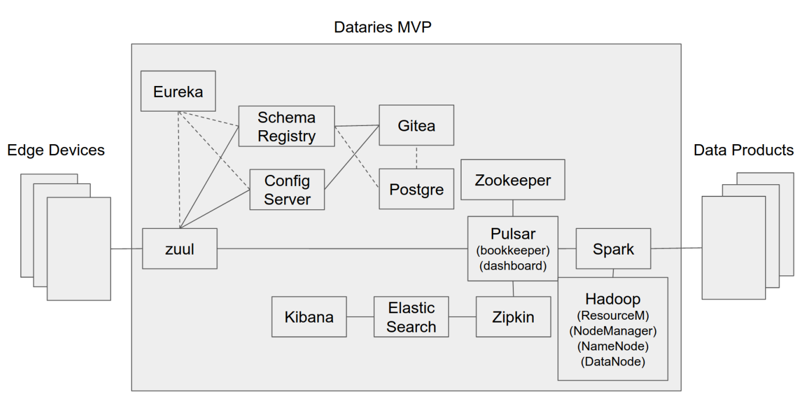
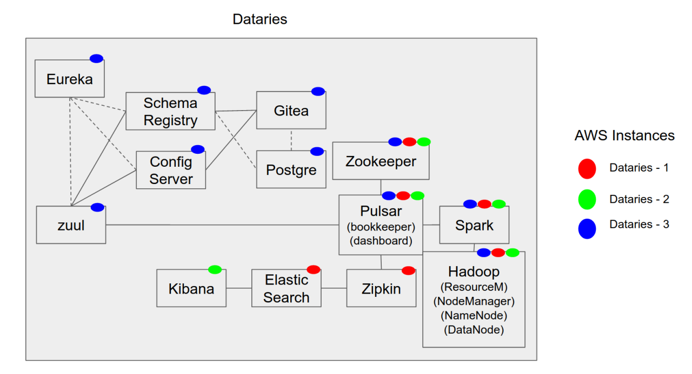

# DATARIES

Dataries is a product that allows the ingestion, processing, analysis, and visualization of large volumes of data from different sources.

## Dataries architecture 

Dataries has a component-based architecture where its developments are interrelated with established and recognized technologies in the big data field.

These components allow the management and configuration of data flow, the management of the traces of all the components of the system, the check of the availability of the elements of the system, as well as the storage and distributed processing of the information.

## Dataries deployment

Dataries can be deployed in a distributed way in different clouds or on local servers since its deployment is based on Docker containers.

Each Dataries, in the image, corresponds to a node in the cluster, therefore they need minimum hardware requirements for their proper deployment:

- 8G de RAM
- 
- 
- 

Dataries has a cluster control plane that contains the launch scripts and provides diagnostics and audits, making the cluster execution safer.

## Dataries open source

Dataries is now an open source product, to encourage the contribution and collaboration of other developers. For this we have used GitHub and Docker Hub. Here is a list of all our docker images and their documentation, that you can download from our `gsiopen` organization:

- [gsiopen/hadoop](https://hub.docker.com/repository/docker/gsiopen/hadoop)
- [gsiopen/config-server](https://hub.docker.com/repository/docker/gsiopen/config-server)
- [gsiopen/schema-registry](https://hub.docker.com/repository/docker/gsiopen/schema-registry)
- [gsiopen/eureka](https://hub.docker.com/repository/docker/gsiopen/eureka)
- [gsiopen/zuul-server](https://hub.docker.com/repository/docker/gsiopen/zuul-server)
- [gsiopen/zookeeper](https://hub.docker.com/repository/docker/gsiopen/zookeeper)
- [gsiopen/pulsar](https://hub.docker.com/repository/docker/gsiopen/pulsar)
- [gsiopen/zuul-client](https://hub.docker.com/repository/docker/gsiopen/zuul-client)

> Each of these docker images brings with it the necessary documentation to put it to work independently, however, to start Dataries, other configurations are needed.

### How to connect Dataries

Dataries can be deployed by using these docker-compose files:

1. [docker-compose 1](./docker-compose/docker-compose.yml)
2. [docker-compose 2](./docker-compose/docker-compose2.yml)

> You should pay attention that you must replace the users and passwords with your own for each service in the docker-compose files

Dataries supports the creation of a private docker-registry if the images are personalized. Dataries is the base for making custom products like new Data products, or for using other components on a functional deployment

It is necessary to mention that components such as Kerberos would improve the security of the Dataries deployment, although it has not been included in this example of deployment, the inclusion of a Kerberos docker image in productive environments is recommended.